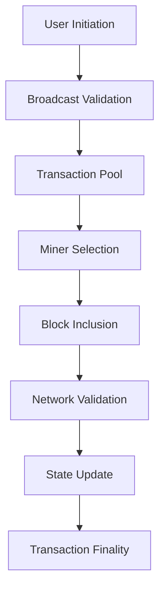

# Understanding Ethereum Transaction Processes: From Initiation to Validation

Ethereum transactions form the backbone of its decentralized ecosystem, enabling value transfers, smart contract interactions, and network state updates. This article explores the complete lifecycle of Ethereum transactions, from initiation to final validation, while integrating key concepts like gas price optimization, blockchain validation, and smart contract execution mechanics.

## 1. Transaction Initiation: Building the Foundation

The Ethereum transaction process begins at the user's wallet interface. Here's the technical workflow:

1. **Wallet Configuration**: Users specify:
   - Source address (From)
   - Destination address (To)
   - Transaction value (Ether amount)
   - Data payload (for smart contract interactions)
   - Gas price (transaction fee per gas unit)

2. **Transaction Signing**: 
   - The wallet automatically calculates:
     - Gas limit (maximum gas units allowed)
     - Nonce (transaction counter for the sender)
   - Uses ECDSA (Elliptic Curve Digital Signature Algorithm) to generate:
     - r, s (signature components)
     - v (recovery identifier)

👉 [Explore crypto wallets on OKX](https://bit.ly/okx-bonus)

### Key Considerations:
- **Gas Price Dynamics**: Users compete for block space through gas bidding. During network congestion, higher gas prices ensure faster confirmation.
- **Nonce Management**: Prevents replay attacks and ensures transaction order. Wallets typically auto-increment nonces for consecutive transactions.

### FAQ: How does gas price affect transaction speed?
Higher gas prices incentivize miners to prioritize transactions. During network congestion, transactions with insufficient gas may remain stuck in the transaction pool for hours or days.

---

## 2. Transaction Broadcasting: Network Dissemination

Once signed, transactions enter the Ethereum network through:

1. **Node Validation**: 
   - Checks include:
     - Valid ECDSA signature
     - Sufficient account balance
     - Correct nonce sequence

2. **Transaction Pool Integration**:
   - Valid transactions enter the mempool (memory pool)
   - Nodes maintain transaction pools to:
     - Prioritize transactions by gas price
     - Prevent double-spending attempts
     - Filter invalid transactions

👉 [Monitor network activity on OKX](https://bit.ly/okx-bonus)

### Technical Insight:
Transaction pools use priority queues to organize pending transactions. Miners select transactions with highest gas prices first, creating a market-driven fee mechanism.

### FAQ: What happens to failed transactions?
Failed transactions still consume gas for computation. They appear in blockchain explorers with "Reverted" status but don't alter Ethereum's state.

---

## 3. Transaction Execution: State Transitions

When miners select transactions for inclusion:

### 3.1 Transaction Categorization
| Transaction Type        | Characteristics                          | State Impact               |
|-------------------------|------------------------------------------|----------------------------|
| Contract Creation       | Empty To field                           | New contract deployment    |
| Contract Interaction    | To field contains contract address       | Smart contract execution   |
| Standard Transfer       | To field contains external account       | Balance transfer           |

### 3.2 Execution Process:
1. **Smart Contract Deployment**:
   - Calculates contract address using sender address + nonce
   - Stores compiled bytecode in Ethereum's state trie

2. **Smart Contract Invocation**:
   - Retrieves contract code from world state
   - Executes EVM (Ethereum Virtual Machine) operations
   - Updates state variables according to contract logic

3. **Ether Transfer**:
   - Deducts value from sender's balance
   - Credits value to recipient's account

### Execution Receipt:
Generated for each transaction containing:
- Contract address (if created)
- Gas used (actual computation cost)
- Logs (event data for dApps)

---

## 4. Block Validation: Consensus Mechanism

When nodes receive new blocks:

### 4.1 Validation Steps:
1. Verify block header (parent hash, timestamp, etc.)
2. Recompute state root from transaction execution
3. Check Proof-of-Work (for pre-Merge blocks)
4. Validate transaction signatures and gas limits

### 4.2 Finality Considerations:
- **Uncle Blocks**: Stale blocks rewarded at 7/8 rate
- **Finality Gadget**: Post-Merge Ethereum uses Casper FFG for finality checkpoints

### FAQ: How many confirmations are needed?
6 confirmations (blocks mined after the transaction) are generally considered secure for high-value transactions.

---

## 5. Transaction Lifecycle Summary

---

## 6. Gas Price Optimization Strategies

For Ethereum users seeking efficient transactions:

1. **Gas Estimation Tools**: Use services like EthGasStation or GasNow for dynamic fee suggestions
2. **Time-of-Day Analysis**: Schedule non-urgent transactions during off-peak hours (UTC nights)
3. **Batch Processing**: Combine multiple operations into single transactions for dApp interactions
4. **Layer 2 Solutions**: Utilize rollups (Optimism, Arbitrum) for cheaper transactions

👉 [Learn gas optimization on OKX](https://bit.ly/okx-bonus)

---

## 7. Transaction Security Best Practices

1. **Nonce Verification**: Manually check nonces for consecutive transactions
2. **Gas Limit Checks**: Ensure gas limits exceed 21,000 (base cost for simple transfers)
3. **Contract Interaction Verification**: 
   - Review contract ABI before sending transactions
   - Use Etherscan's contract verification system
4. **Wallet Security**:
   - Store private keys in hardware wallets
   - Enable 2FA for custodial solutions

---

## Conclusion: The Ethereum Transaction Ecosystem

Understanding Ethereum's transaction mechanics is crucial for developers, traders, and users navigating the blockchain landscape. From initial signing to final validation, each step plays a vital role in maintaining network integrity and efficiency. As Ethereum continues evolving through upgrades like EIP-1559 and layer 2 scaling solutions, staying informed about transaction dynamics becomes increasingly important for optimal participation in the decentralized economy.

### FAQ: How do Ethereum upgrades affect transactions?
Major upgrades like London (EIP-1559) introduced base fee mechanisms, changing gas price dynamics. Future upgrades may further optimize transaction processing through sharding or state rent implementations.

### FAQ: What's the difference between gas price and gas limit?
Gas price (denominated in gwei) determines transaction priority, while gas limit specifies the maximum computational work allowed. Exceeding the gas limit results in transaction reversion with consumed gas fees.